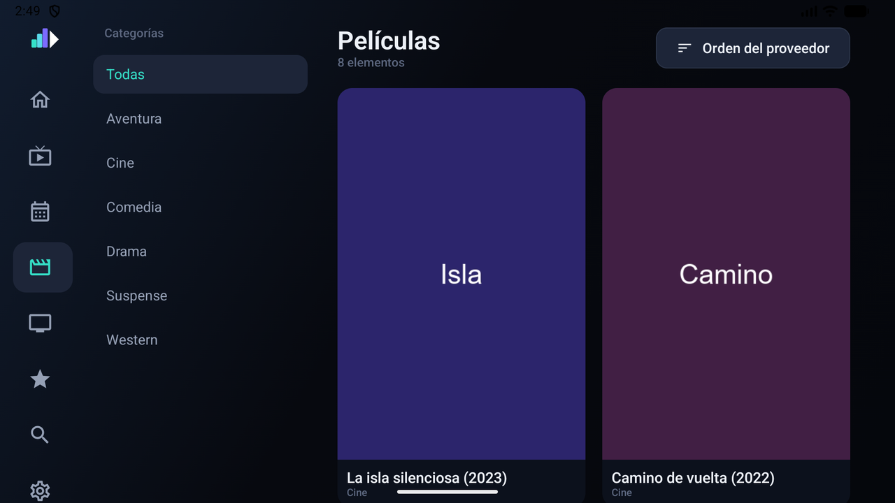

# Kanal

<p align="center">
  <a href="https://github.com/mateof/kanal-tv/actions/workflows/release.yml"></a>
  <a href="https://github.com/mateof/kanal-tv/releases/latest"></a>
  <a href="https://github.com/mateof/kanal-tv/releases"></a>
  <a href="#requisitos"></a>
  <a href="#compatibilidad"></a>
  <a href="https://kotlinlang.org"></a>
  <a href="LICENSE"></a>
  <a href="https://github.com/mateof/kanal-tv/commits/main"></a>
</p>

Reproductor de televisión para **Android TV, Google TV y Fire TV**, escrito en Kotlin con
Jetpack Compose. Se conecta a paneles **Xtream Codes** (incluido
[Dispatcharr](https://github.com/Dispatcharr/Dispatcharr)) y a **listas M3U/M3U8**, con guía
de programación **XMLTV**.


<table>
  <tr>
    <td></td>
    <td></td>
  </tr>
  <tr>
    <td></td>
    <td></td>
  </tr>
</table>

## Características

- **Televisión en directo** con categorías, favoritos, programa actual y siguiente, y vista
  previa del canal enfocado dentro de la propia lista.
- **Guía XMLTV** en dos formatos: mural con todos los canales, con bloques dimensionados
  según la duración real, y detalle por canal con selector de día. El emparejamiento se
  realiza por `tvg-id` y, en su defecto, por nombre de canal.
- **Películas y series** con fichas, temporadas, episodios y reanudación.
- **Repeticiones** en los paneles Xtream Codes que exponen `tv_archive`.
- **Búsqueda** sobre canales, películas y series, sin distinguir mayúsculas ni acentos.
- **Interfaz en galego, castellano e inglés**, con selección automática según el idioma del
  aparato.
- **Tolerancia a interrupciones**: reconexión automática ante cortes de la emisión y prueba
  de contenedores alternativos cuando un canal no responde.
- **Envío a otro aparato** de la red mediante DLNA/UPnP, sin necesidad de Chromecast ni de
  servicios de Google.
- **Ventana flotante** (picture-in-picture) sin interrumpir la emisión.
- **Temporizador de apagado** y aviso de inactividad configurable.
- **Manejo táctil y disposición vertical** en móvil y tablet.
- **Registro exportable** de la actividad de la aplicación.
- **Actualización integrada** desde las releases del repositorio.

## Documentación

Disponible en [`docs/`](docs/README.md):

- [Primeros pasos](docs/primeros-pasos.md) — instalación, alta de la fuente y sincronización
- [Televisión en directo](docs/television.md) — lista, guía, reproductor y manejo con mando
- [Películas y series](docs/peliculas-y-series.md) — catálogos, fichas y reanudación
- [Ajustes](docs/ajustes.md) — referencia de todos los ajustes
- [Diagnóstico](docs/diagnostico.md) — registro, actualizaciones y resolución de problemas

## Compatibilidad

| Fuente | Recursos utilizados |
| --- | --- |
| Xtream Codes / Dispatcharr | `player_api.php` (`get_live_streams`, `get_vod_streams`, `get_series`, `get_series_info`, `get_short_epg`), `xmltv.php`, `/live/…`, `/movie/…`, `/series/…`, `/timeshift/…` |
| M3U / M3U8 | `#EXTINF` con `tvg-id`, `tvg-name`, `tvg-logo`, `group-title`, `catchup-days`, `url-tvg` |
| Guía | XMLTV en texto plano o comprimido en gzip |

La lectura de las respuestas de los paneles admite las variaciones habituales entre
implementaciones: valores numéricos enviados como texto, booleanos como `0`/`1`/`"true"` y
colecciones vacías representadas mediante `{}` en lugar de `[]`. Las URL de servidor que
incluyan `/player_api.php` o parámetros de consulta se normalizan automáticamente.

## Requisitos

- Android 6.0 (API 23) o superior.
- Una fuente Xtream Codes o una lista M3U propia. **Kanal no incluye ni proporciona
  contenido.**

## Instalación

Descargar el APK de la [última release](https://github.com/mateof/kanal-tv/releases/latest) e
instalarlo mediante *Downloader*, `adb install` o el gestor de archivos del aparato. La
aplicación notifica las versiones posteriores.

## Compilación

```bash
export JAVA_HOME="/ruta/a/un/jdk-21"
./gradlew :app:assembleDebug
```

Requiere un fichero `local.properties` con `sdk.dir` apuntando al SDK de Android.

## Licencia

GPL-3.0. Ver [LICENSE](LICENSE).
