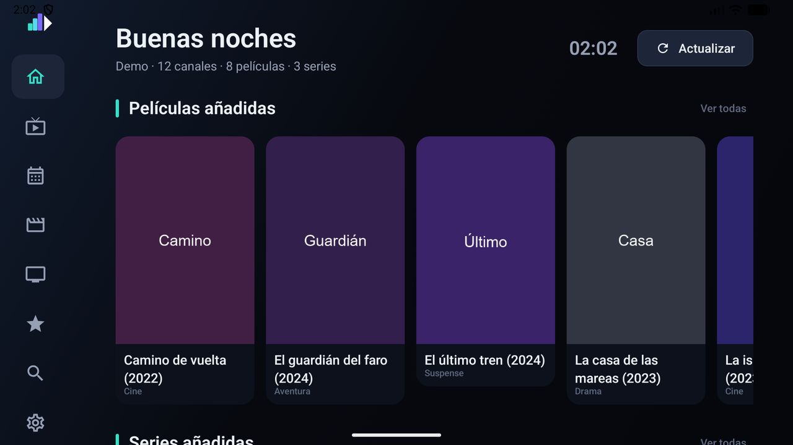
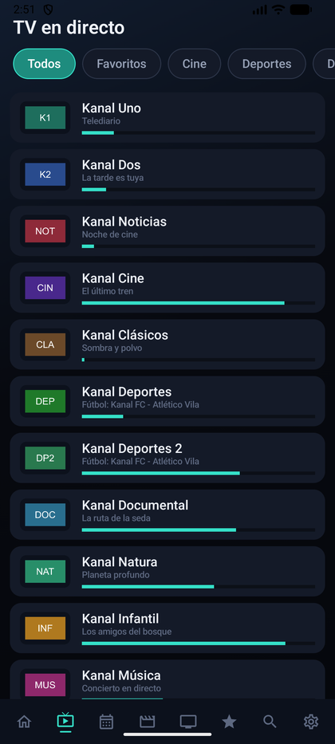

# Documentación de Kanal

Kanal es un reproductor de televisión para **Android TV, Google TV y Fire TV**. Se conecta a
un panel **Xtream Codes** (incluido Dispatcharr) o a una **lista M3U**, y descarga la guía de
programación en formato **XMLTV**.

Kanal no incluye ni proporciona contenido. Requiere una fuente propia.

## Índice

| Documento | Contenido |
| --- | --- |
| [Primeros pasos](primeros-pasos.md) | Instalación, alta de la fuente y sincronización |
| [Televisión en directo](television.md) | Lista de canales, guía, reproductor y manejo con mando |
| [Películas y series](peliculas-y-series.md) | Catálogos, fichas y reanudación |
| [Ajustes](ajustes.md) | Referencia de todos los ajustes |
| [Diagnóstico](diagnostico.md) | Registro, actualizaciones y resolución de problemas |

## Pantalla de inicio

Reúne el contenido sincronizado recientemente, las reproducciones sin terminar y los canales
marcados como favoritos. El menú lateral permanece contraído en iconos y se despliega
únicamente cuando recibe el foco.

## Televisión en directo

La lista de canales ocupa la columna izquierda. El panel derecho muestra una vista previa del
canal enfocado junto con el programa en emisión, el siguiente y la programación del día.

## Reproductor

La información en pantalla incluye canal, programa, progreso y los controles principales. Se
oculta automáticamente y reaparece con cualquier pulsación.

## Guía de programación

Muestra todos los canales simultáneamente, con los bloques dimensionados según la duración
real de cada programa. La franja horaria se desplaza en tramos de dos horas y admite filtrado
por categoría.

## Disposición vertical

Kanal está diseñado para televisión. En móvil y tablet admite manejo táctil y disposición
vertical: cada pantalla conserva su diseño ancho y añade una variante estrecha.

