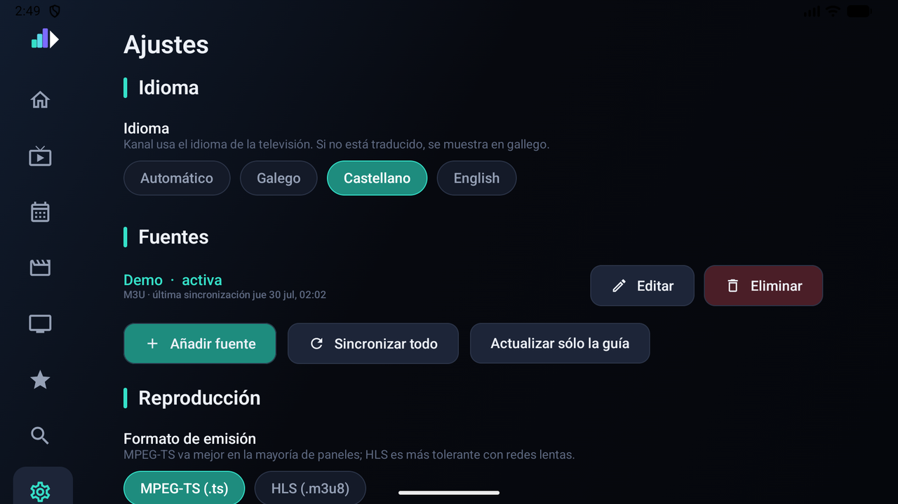
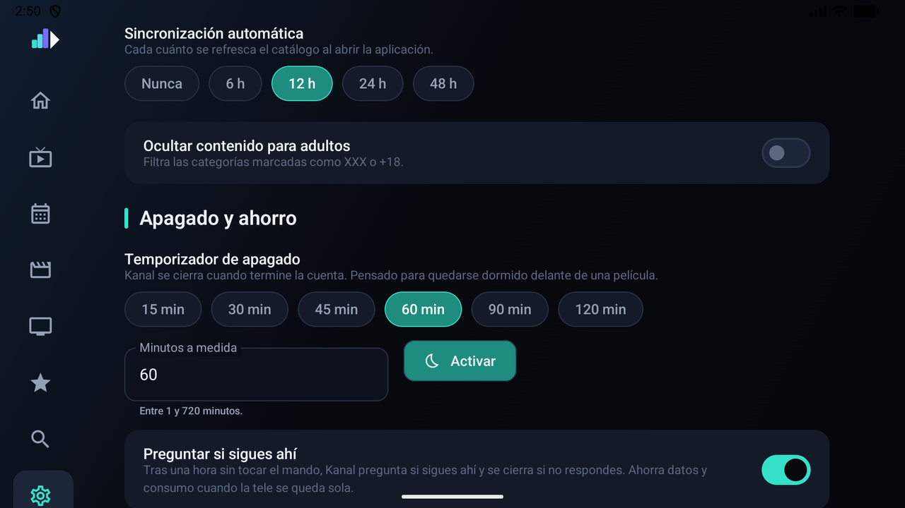
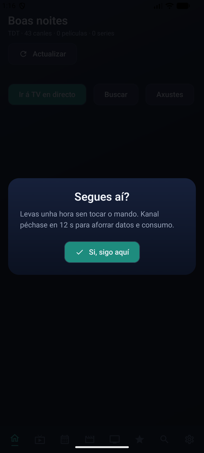

# Ajustes

Todos los ajustes, en el orden en que aparecen.

## Idioma

Kanal habla **galego, castellano e inglés**, y va primero en la lista a propósito: quien abra
la app en un idioma que no lee tiene que poder cambiarlo sin leer nada más.

- **Automático** (por defecto) usa el idioma de la televisión.
- Si ese idioma no está traducido, se muestra en **galego**.
- La elección se aplica al instante y se recuerda.

Las **fechas** siguen el idioma elegido, no el de la tele: quien tenga el panel en inglés y
Kanal en galego ve «xoves 30 de xullo», no «Thursday 30 de xullo».

## Fuentes

Añadir, editar y eliminar fuentes, y elegir cuál está activa con **Usar**. **Eliminar** pide
confirmación en el propio botón y borra también el contenido cacheado de esa fuente.

Ver [Primeros pasos](primeros-pasos.md#añadir-la-fuente) para los campos.

## Reproducción

### Formato de emisión

`MPEG-TS (.ts)` o `HLS (.m3u8)`. TS va mejor en la mayoría de paneles; HLS aguanta mejor las
redes lentas. Es sólo la **preferencia**: si un canal no funciona en el formato elegido, Kanal
prueba el otro por su cuenta.

### Búfer

| Perfil | Para qué |
| --- | --- |
| Bajo | Zapping rápido; cambia de canal antes |
| Normal | El de siempre |
| Alto | Conexión inestable |
| Máximo | Servidor con cortes; hasta 45 s de arranque y 180 s de búfer |

Cuanto más grande, más tarda en arrancar y mejor aguanta los bajones.

### Vista previa en la lista de canales

Reproduce el canal enfocado en el panel de la derecha tras un momento. Si tu proveedor limita
mucho las conexiones simultáneas, apagarla ayuda.

### Aguantar cortes del servidor

Activado por defecto. Cuando la emisión se corta:

- **reconecta sola** hasta seis veces, con espera creciente, mostrando «Reconectando…» sin
  sacarte del canal;
- **insiste más** ante los fallos de red: doce reintentos por fragmento en vez de tres.

La reconexión se limita **a los errores de conexión**, a propósito. Un fallo de contenedor o
de decodificación suele significar que la fuente llega dañada —una antena floja alimentando un
sintonizador, por ejemplo— y reiniciar el stream en cada frame corrupto cambia un artefacto de
medio segundo por un rebuffer completo. Para eso, ver
[Diagnóstico](diagnostico.md#se-ve-a-cortes).

### Recordar el último canal

Al salir de un canal con ATRÁS sigue sonando en la vista previa; desde la lista, ATRÁS lo
devuelve a pantalla completa y dos veces seguidas sale. Explicado en
[Televisión en directo](television.md#recordar-el-último-canal).

### User-Agent por defecto

Algunos proveedores sólo responden a un agente concreto y bloquean los que no conocen. Por
defecto Kanal se presenta como VLC, que casi todos aceptan. Se puede fijar otro por fuente al
darla de alta.

## Guía y contenido

- **Días de guía a descargar** — 1, 2, 3, 5 o 7. Cuantos más, más tarda la sincronización y
  más ocupa.
- **Sincronización automática** — cada cuánto se refresca el catálogo al abrir la app.
- **Ocultar contenido para adultos** — filtra las categorías marcadas como XXX o +18.

## Apagado y ahorro

### Temporizador de apagado

Para quedarse dormido delante de una película. Presets de 15 a 120 minutos, o los minutos que
quieras entre 1 y 720. Al **Activar**, Kanal muestra la cuenta atrás; en el último minuto
aparece un aviso discreto con **Seguir viendo** para cancelarlo, y al llegar a cero cierra la
aplicación.

No se guarda entre sesiones a propósito: un temporizador es para esta noche, y encontrarlo
armado al día siguiente sería una sorpresa desagradable.

### Preguntar si sigues ahí

Activado por defecto. Tras **una hora sin tocar el mando**, Kanal pregunta si sigues ahí y se
cierra si no respondes en un minuto. Un canal olvidado toda la noche gasta datos de la casa y
horas del panel.

Cualquier tecla cuenta como respuesta, no hace falta acertar con el botón.

## Aplicación

- **Buscar actualizaciones automáticamente** — comprueba las releases de GitHub al abrir la
  app, como mucho una vez cada seis horas.
- **Registro detallado de red** — anota cada petición HTTP. Útil para diagnosticar, ruidoso
  para el día a día.
- **Versión instalada**, con **Buscar actualizaciones**, **Descargar e instalar** y
  **Ver registro**.

### Borrar historial

Vacía «Continuar viendo» y los vistos hace poco. No toca los favoritos.

### Vaciar caché de contenido

Borra el catálogo y la guía descargados. Hay que sincronizar después para volver a tenerlos.
Útil si algo se quedó a medias en una sincronización interrumpida.
