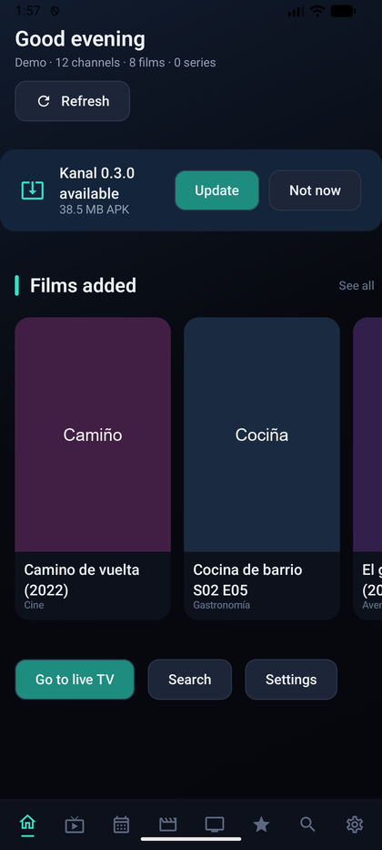

# Diagnóstico

## El registro

Kanal anota lo que hace en un fichero: sincronizaciones, peticiones, reproducciones, errores.
Se ve en **Ajustes → Ver registro**, con filtro por nivel (todo, info, avisos, errores).

Desde ahí se puede:

- **Compartir** — abre el selector del sistema, útil en móvil y tablet.
- **Exportar a fichero** — deja el registro en el almacenamiento y muestra la ruta en
  pantalla, porque en una tele muchas veces no hay a dónde compartir.
- **Borrar**.

Las URL van **redactadas** en el registro: no lleva usuarios ni contraseñas de tu panel. Aun
así, mira lo que envías antes de pegarlo en un sitio público.

Con **Registro detallado de red** activado se anota además cada petición HTTP. Enciéndelo sólo
mientras buscas un fallo concreto.

## Actualizaciones

Kanal mira las releases de este repositorio y avisa en la portada cuando hay una nueva.



**Actualizar** descarga el APK y lanza la instalación. La primera vez Android pide permiso
para instalar aplicaciones desde Kanal; si lo deniegas, el aviso lo recuerda y se puede
reintentar.

La comprobación automática se limita a una vez cada seis horas para no molestar al proveedor
ni a GitHub.

## Se ve a cortes

Antes de tocar nada en la app, **mide el stream**. Un minuto con ffmpeg distingue tres cosas
que se parecen mucho en pantalla y se arreglan en capas distintas:

```bash
ffmpeg -hide_banner -loglevel warning -i "URL_DEL_STREAM" -t 60 -f null - 2> errores.txt
sort errores.txt | sed 's/[0-9]\+/N/g' | sort | uniq -c | sort -rn | head -20
```

| Lo que sale | Qué es | Dónde se arregla |
| --- | --- | --- |
| `Packet corrupt`, `non-existing PPS`, `Missing reference picture` | La fuente llega **dañada** | En el origen: antena, sintonizador, cable |
| Timeouts, conexión cerrada, HTTP 5xx | Problema de **red o servidor** | «Aguantar cortes del servidor» ayuda |
| Nada raro, pero a tirones | **Caudal** insuficiente | Búfer más grande |

**Ninguna opción del reproductor arregla bits que ya llegan rotos.** Si el diagnóstico es
corrupción de origen, lo que toca es mirar la instalación, no la app.

### Si la fuente es un TVHeadend propio

Dos comprobaciones que ahorran mucho tiempo:

```bash
# calidad de señal del sintonizador
curl -s "http://SERVIDOR:9981/api/status/inputs"
# perfiles de emisión disponibles
curl -s "http://SERVIDOR:9981/api/profile/list"
```

En `status/inputs`, con `signal_scale = 2` el valor de `signal` son milésimas de dBm. **Señal
fuerte con SNR bajo es saturación**, no señal débil: si hay amplificador, hay que bajarle la
ganancia o quitarlo. Lo contrario de lo que dice el instinto.

TVHeadend acepta `?profile=` también en la playlist:

```
http://SERVIDOR:9981/playlist/channels?profile=UN_PERFIL_DE_TRANSCODIFICACION
```

Con el perfil `pass` entrega el TS crudo con todos sus errores; con uno de transcodificación,
ffmpeg del servidor recodifica y oculta los daños. Cuesta CPU en el servidor, y los perfiles
`webtv` de serie **bajan la resolución** —conviene mirar a cuánto— así que merece la pena
crearse uno que mantenga 1080p.

## «Error de contenedor no soportado»

Significa que el servidor no envía vídeo en un formato reconocible en esa URL. Kanal ya prueba
por su cuenta el otro contenedor y la ruta antigua antes de dar el error, así que si llega
hasta aquí normalmente es que **el canal está caído** o que se alcanzó el **límite de
conexiones** del proveedor. Prueba otro canal: si va, era eso.

## No instala en la tele

Por orden de probabilidad:

1. **Espacio libre.** En las teles de 8 GB es la causa más común y el mensaje no lo dice.
2. **Orígenes desconocidos** sin permitir para la app desde la que instalas.
3. Una **versión anterior firmada con otra clave**: hay que desinstalarla primero.

Para ver el motivo real en vez de adivinar:

```bash
adb install -r kanal-x.y.z.apk    # imprime el INSTALL_FAILED_... concreto
```

## Recoger un fallo para reportarlo

1. Ajustes → **Registro detallado de red** encendido.
2. Reproduce el fallo.
3. Ajustes → Ver registro → **Exportar a fichero**.
4. Apaga otra vez el registro detallado.

Con eso y la versión instalada (aparece en Ajustes) hay bastante para empezar a mirar.
