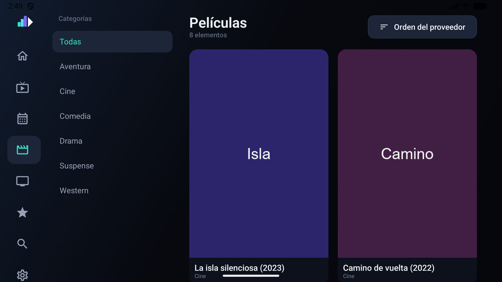

# Películas y series

## Catálogos

Las categorías del proveedor ocupan la columna izquierda y las carátulas la rejilla derecha.
El botón superior alterna el criterio de ordenación: orden del proveedor, nombre, añadido
recientemente o valoración.

Las series disponen de una sección equivalente.

Al volver de una ficha, el catálogo conserva el punto por el que iba y deja el foco sobre la
película o la serie que se abrió.

## Fichas

La ficha de una película muestra carátula, sinopsis, año, duración, valoración, dirección y
reparto, junto con los botones de reproducción y de favoritos.

En las series se añade un selector de temporada y el listado de episodios correspondiente.

Los metadatos proceden del panel. Su disponibilidad varía según el proveedor: los campos
ausentes no se muestran. Kanal admite las variaciones habituales de formato, como valores
numéricos enviados como texto o colecciones vacías representadas mediante `{}`.

## Reanudación

Kanal registra la posición de cada película y episodio. Al abrirlos de nuevo, el botón
principal ofrece continuar desde ese punto, con la alternativa de empezar desde el principio.

La posición se guarda al pausar, al salir de la reproducción y cada quince segundos mientras se
reproduce, de modo que no se pierde si la aplicación se cierra de forma inesperada. El
contenido reproducido más allá del 95 % se considera terminado y deja de ofrecerse para
continuar.

El contenido pendiente aparece en la portada, bajo **Continuar viendo**, con indicación del
progreso. Los títulos completados dejan de mostrarse.

El historial se almacena en el aparato y puede borrarse desde
[Ajustes](ajustes.md#borrar-historial).

## Descargas

En la ficha de una película está **Descargar**, y en la de una serie **Descargar la
temporada** más una flecha en cada episodio para bajarlos de uno en uno. El botón va contando
lo que lleva —`Descargando 34 %`— y acaba en **Descargada**.

Los ficheros se guardan en **`Descargas/Kanal`**, con el nombre del contenido, así que se ven
desde cualquier explorador de ficheros y se pueden copiar o abrir con otro reproductor.

El apartado **Descargas** del menú reúne lo que está en marcha y lo que ya está en el
dispositivo, con el espacio que ocupa. Al pulsar sobre algo descargado, se reproduce; una
pulsación larga abre el menú con **Borrar del dispositivo**, **Borrar la serie entera**,
**Detener** y **Reintentar**.

Una vez descargado, **al darle a reproducir se usa la copia local**, incluso sin conexión. Si
el fichero desapareció —lo borraste desde el explorador, por ejemplo— la reproducción cae
sola en el servidor, sin dar error.

Lo que **no** se puede descargar: los canales en directo, que no tienen final, y las listas
que sirven el contenido en HLS (`.m3u8`), que no es un fichero sino una sucesión de trozos.

Y un detalle que conviene saber: **cada descarga ocupa una conexión de tu cuenta** mientras
dura, igual que si estuvieras viendo algo. Con un límite de conexiones bajo, descargar y ver
la tele a la vez puede no caber.

## Enviar a otro aparato

Las películas ofrecen **Enviar a…** en su ficha, y los episodios responden a una pulsación
larga en la lista. En ambos casos el contenido se envía sin abrirse aquí. Ver
[Televisión en directo](television.md#enviar-a-otro-aparato) para los detalles.

## Favoritos

Canales, películas y series admiten marcado como favoritos, y todos ellos se agrupan en la
sección **Favoritos**. En la lista de canales, además, **Favoritos** figura como una categoría
más de la franja superior.

## Búsqueda

La búsqueda abarca canales, películas y series de la fuente activa a partir de dos
caracteres, sin distinguir mayúsculas ni acentos.

En la ordenación alfabética de canales se ignora la numeración inicial, de modo que entradas
como `101. La 1` o `|ES| La 1` se ordenan por el nombre del canal.
