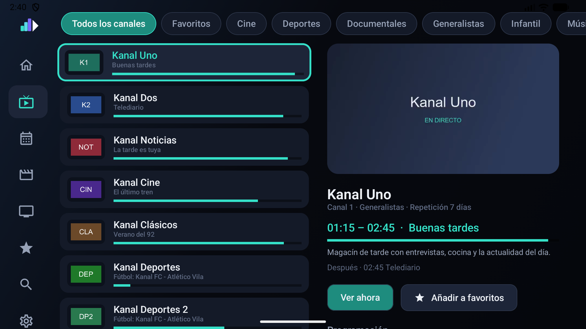
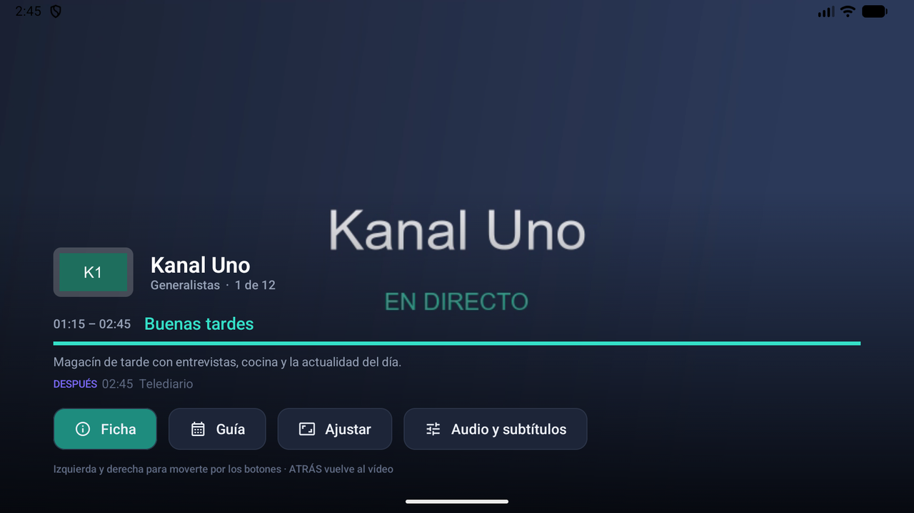
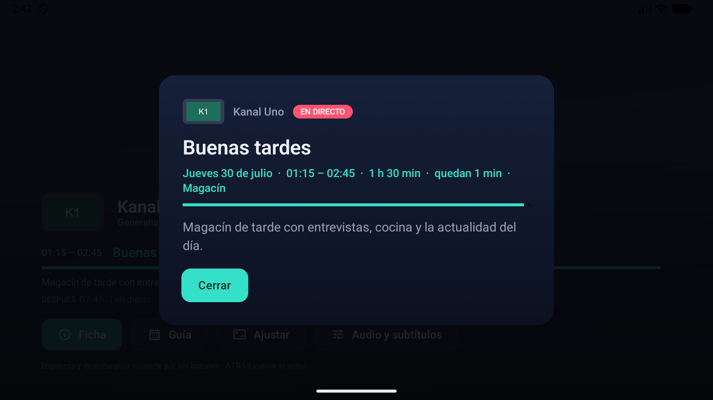
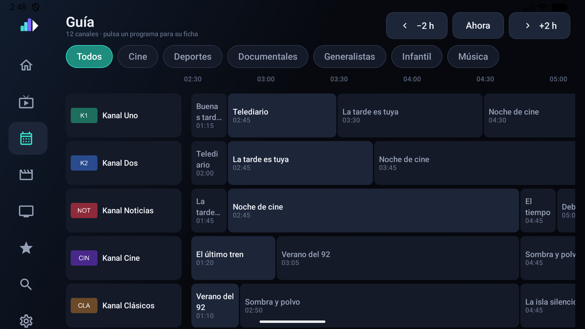

# Televisión en directo

## La lista de canales

Arriba, las categorías del proveedor como tira de chips, más **Todos los canales** y
**Favoritos**. A la izquierda los canales, con su logo, el programa de ahora y una barra de
cuánto lleva. A la derecha, el canal enfocado.

### Vista previa

Al detenerte sobre un canal, y tras un instante, empieza a reproducirse en el panel derecho.
La pausa es a propósito: sin ella, bajar diez canales abriría diez conexiones al proveedor.
Se apaga en [Ajustes](ajustes.md#vista-previa-en-la-lista-de-canales).

Debajo salen el programa actual con su descripción, el siguiente, y **Ver ahora** /
**Añadir a favoritos**. Más abajo, la programación del día con selector de día.

### Recordar el último canal

Con este ajuste puesto, al salir de un canal con **ATRÁS** sigue sonando en la vista previa
en vez de callarse. Y desde la lista:

- **ATRÁS** vuelve a ponerlo a pantalla completa.
- **ATRÁS dos veces seguidas** (rápido) sale de la lista.

La idea es que salir del canal por error no cueste nada.

## El reproductor

El OSD se muestra al entrar y al pulsar cualquier tecla, y se va solo. Trae el logo y nombre
del canal, la posición en la lista, el programa con su franja y progreso, la descripción y el
**DESPUÉS**. Si el título no cabe, se desplaza para poder leerlo entero.

### Mando

| Tecla | En directo | En películas y series |
| --- | --- | --- |
| **Arriba / Abajo** | Canal siguiente / anterior | — |
| **Izquierda / Derecha** | — | ±10 segundos |
| **OK** | Abre los controles | Abre los controles |
| **ATRÁS** | Sale | Sale |

Con los controles abiertos, **izquierda y derecha** se mueven por los botones y **ATRÁS**
vuelve al vídeo. La línea de ayuda al pie lo recuerda, porque muchos mandos de tele no tienen
tecla de menú y no es evidente.

### Botones

- **Ficha** — la descripción completa del programa en un modal.
- **Guía** — la programación del canal sin salir del vídeo.
- **Ajustar** — cicla entre ajustar, zoom y estirar, para el material que no viene a 16:9.
- **Audio y subtítulos** — las pistas que trae la emisión, con su idioma y códec.

### Cuando algo falla

Si la emisión no arranca, Kanal prueba **otros formatos de contenedor** para el mismo canal
antes de rendirse: muchos paneles anuncian `.ts` y sirven HLS, o al revés. Si aun así falla,
sale un mensaje concreto —no un código— con **Reintentar** y **Volver**.

Con [«Aguantar cortes del servidor»](ajustes.md#aguantar-cortes-del-servidor) activado,
además reconecta sola varias veces mostrando «Reconectando…» en pantalla, sin echarte del
canal.

## La guía

Un muro con todos los canales a la vez. Los bloques van a escala real: un programa de dos
horas ocupa el doble que uno de una. Se navega con **−2 h / Ahora / +2 h** y se filtra por
categoría.

Al pulsar un programa se abre su **ficha**, no el canal. Para ir al canal está el icono de la
tele en la propia ficha. Es a propósito: en un muro tan denso, tocar sin querer y perder lo
que estabas viendo es demasiado fácil.

El muro se corta en **150 canales y 6 horas** por pasada para que se pueda mover con
suavidad en un aparato modesto.

### Repeticiones

En los paneles Xtream que exponen `tv_archive`, los programas ya emitidos ofrecen **Ver
repetición**. Los días disponibles salen en la ficha del canal («Repetición 7 días»).
